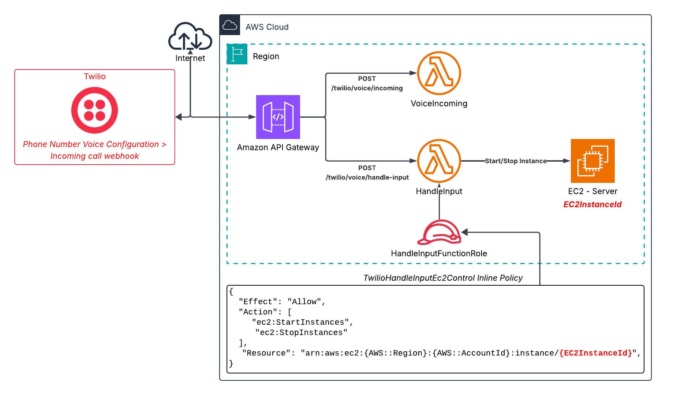

# Readme - Twilio AWS Control Stack

This repo contains a small CloudFormation template that creates a REST API and Lambda functions enabling a Twilio Voice Incoming webhook to control the running state of an EC2 instance.



## Scripts

```
.
├── deploy.sh
└── validate.sh
```

### Deploy

The `deploy.sh` script packages the Lambda code and `template.yaml` file and uploads it to a predefined S3 bucket. The upload bucket is specified in `.env` as `CF_BUCKET_NAME`.

Run the script from it's folder:

```bash
./deploy.sh
```

### Validate

The `validate.sh` script simply runs the `aws cloudformation validate-template` command against the `template.yaml` file. If the initial validation passes, it then runs `cfn-lint` to catch any additional errors.

Run the script from it's folder:

```bash
./validate.sh
```

## Configuring Twilio

> _Updated 16 June 2026_

In the Twilio Developer console, locate the configuration for the number to connect. In the left sidebar: **Develop** > **Phone Numbers** > **Manage** > **Active Numbers**. Select the number and view the **Configure** tab.

Under the **Voice Configuration** section apply the following settings:

- **Configure with**
  - _Webhook, TwiML Bin, Function, Studio Flow, Proxy Service_
- **A call comes in**
  - _Webhook_
- **URL**
  - _\*Copy the `VoiceIncomingWebhookUrl` value from the CloudFormation output._
- **HTTP**
  - _HTTP POST_
